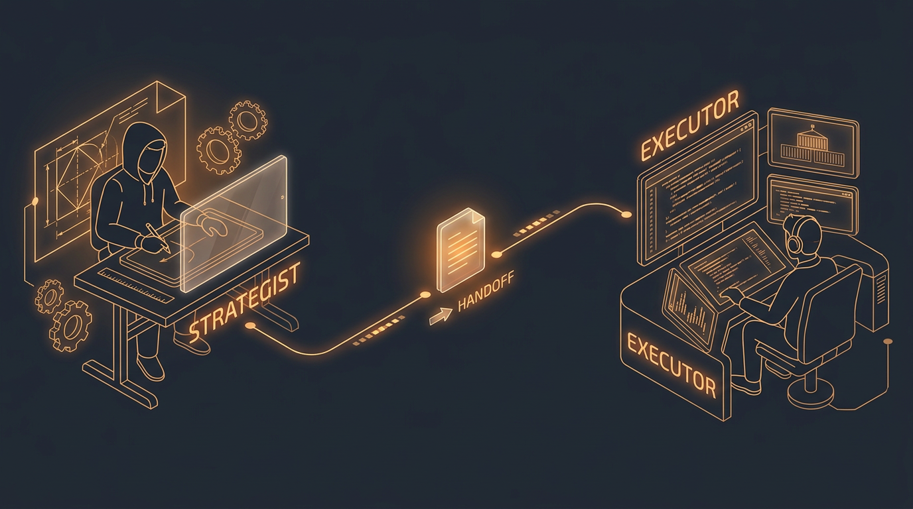
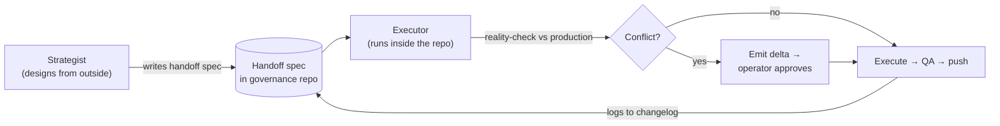

<h1 align="center">AI Dev Governance</h1>

<p align="center">
  <strong>A field-tested model for running AI coding agents across many repos — a planner that can't commit, an executor that can, and the file discipline that keeps them honest.</strong>
</p>

<p align="center">
  <em>Actor-agnostic. Pair any strategist-style AI with any executor-style agent.</em>
</p>

<p align="center">
  
  
  
  
</p>

<!-- Add your Runway hero banner at assets/hero.png, then this renders. Delete these two lines if you don't want a banner. -->
<p align="center">
  
</p>

---

**Your AI agent forgot everything from yesterday. It just overwrote a file that was working. And the "plan" it confidently executed was based on a database that hasn't looked like that in weeks.**

If you've felt any of that, you've hit the wall this repo is about. It's not a tool to install — it's the governance model a small shop evolved while running two AI actors across ~20 repositories, written down so you can skip the painful parts. Every pattern here is the scar tissue of a specific mistake.

> **The goal isn't to make AI write more code faster — it's to make sure the code it writes is the code you actually wanted, every time, without you watching it type.**

**Who this is for:** solo developers and small teams using AI coding agents — usually a chat assistant *plus* a terminal agent — across more than one repo. New devs get a structure to model from before the walls show up; experienced devs hitting those walls get a map out.

---

## 🚀 How to use this repo

You don't read this like a tutorial. You hand it to your AI and let it adapt the model to *your* setup.

**1. Point your Strategist at this page.** Paste the prompt below into whatever chat-based AI you use, with this README in context (paste the raw file, or give it the repo URL).

```text
You are acting as my Strategist. Read this entire page top to bottom.

Then, given my setup:
- Repos / projects: <e.g. 3 Next.js apps + a shared package>
- My Strategist tool: <e.g. Claude in the web app>
- My Executor tool: <e.g. Claude Code in my terminal>
- Where my files live: <e.g. ~/dev, GitHub org "acme">

Assess how to adapt this governance model to MY environment. Tell me:
1. Which of my tools should play Strategist vs Executor, and why.
2. What my AGENT.md cascade should look like (global → family → project).
3. The single smallest first step I can take this week.
Flag anything in this model that doesn't fit my situation — don't force it.
```

**2. Map the two roles to your tools** (see below — the roles matter more than the brands).

**3. Adopt the minimum core first:** the two-role split and checkpoints. That alone kills most of the pain.

**4. Grow into the rest** — the cascade, the Sanity Check, the roadmap index — as your repo count climbs. The [deep dives](#-deep-dives) cover each facet in isolation.

---

## 🧩 Works with any Strategist + Executor

This model is **actor-agnostic.** It describes two *roles*, not two products. Slot in whatever you already use.

| Role | What it needs to be good at | Example tools |
| :---- | :---- | :---- |
| **Strategist** | Research, architecture, writing specs. Works *outside* the repo. Needs no commit access — and shouldn't have it. | Claude (web/app), ChatGPT, Perplexity, Gemini |
| **Executor** | Lives *inside* the repo. Runs the build, tests, and DB queries. Commits and pushes. | Claude Code, Codex, Cursor, GitHub Copilot, Gemini CLI, Aider |

**Example pairings** — all equally valid:

| Strategist | Executor |
| :---- | :---- |
| Claude (app) | Claude Code |
| Perplexity | Codex |
| ChatGPT | Cursor |
| Gemini (web) | Gemini CLI |

…or any combination. Pick whatever you already pay for; the discipline is in the *handoff between the roles*, not the logos.

---

## The six lessons at a glance

1. The planning AI is blind and amnesiac — so don't let it touch code.
2. Sessions die mid-task — so write to disk constantly and verify.
3. A spec written blind will collide with production — so reality-check before executing.
4. Rules conflict across scopes — so define a precedence order up front.
5. "Roadmaps" multiply and drift — so stop expecting them to sync.
6. "Done" means shipped and verified — not "the code is written."

---

## Part I — Six lessons that shaped everything

Each of these began as a painful mistake. The protocols in Part II exist to make each mistake hard to repeat.

### 1. The planning AI is blind and amnesiac — so don't let it touch code

A chat-based Strategist can't run your type-checker, doesn't read your repo's rules at session start, and remembers nothing from the last session. It's excellent at research, architecture, and spec-writing — and risky the moment it edits a real file, because it's guessing at production state.

**The rule:** the Strategist never writes source, never edits env/config, never runs the database, never commits. When it's tempted to "just fix it quick," it writes a **handoff spec** instead, and the Executor applies that spec with type-checking and conventions in force. Persistence lives in files, never in the assumption that an agent will "remember."

### 2. Sessions die mid-task — so write to disk constantly and verify

AI sessions time out, and a cloud agent's working filesystem is ephemeral — it resets when the session ends. Batching all your writes "for the end" turns a timeout into total loss.

**The rule:** write directly to the persistent (operator's) filesystem, incrementally, one file per completed step. Then **read the file back** — a "success" response from a write tool is not proof on its own. And drop a **checkpoint** at the start of any multi-step task, after each major step, and at the end of every session, so the next session resumes exactly where this one stopped.

### 3. A spec written blind will collide with production — so reality-check before executing

The Strategist designs without seeing live data. Treat **every handoff as a design, not a law.** Before implementing one, the Executor runs a quick reality check against production: existing records, naming collisions, foreign-key relationships, and anything already sent, paid, or deployed.

This rule was bought the hard way. Early on, a spec renamed a billing record that had *already issued invoices* — and those invoices then displayed under the wrong name. A reality check that queried the live billing records first would have caught it. That's why specs are now validated against production before a single line lands. → [Full walkthrough](docs/sanity-check.md)

### 4. Rules conflict across scopes — so define a precedence order up front

In a multi-repo enterprise, a global rule, a shared-infrastructure rule, a team-wide convention, and a project-specific override can all apply to the same task. Without a declared order, the agent picks one at random.

**The rule:** a written precedence cascade decides which wins (see Foundation 2). More specific scopes override more general ones for project details; more general scopes still govern routing and cross-project behavior.

### 5. "Roadmaps" multiply and drift — so stop expecting them to sync

A real codebase grows several "what's left to build" surfaces: a product roadmap (decisions, pricing, version planning), an execution roadmap per repo (what ships next), and often a database-backed dashboard. People assume these stay in lockstep. They don't, and trying to auto-sync them is a trap.

**The rule:** keep the genres separate on purpose, accept that mismatches are normal, and maintain **one index** as the single entry point that catches drift *on audit* rather than pretending everything is always aligned.

### 6. "Done" means shipped and verified — not "the code is written"

The cheapest place to catch a regression is before "complete" is declared.

**The rule:** Tier-2-and-up work isn't done until it passes a fixed gate — type-check clean, diff shows only intended files, no hardcoded secrets, acceptance criteria verified, pushed to main, and the host's build confirmed green. The deploy *is* the review.

---

## Part II — The architecture (reference)

### The four foundations

Everything else layers on top of these four.

| System | What it answers |
| :---- | :---- |
| **Repo schema + routing** | Which family does this work belong to? Which rules apply? |
| **Context-file cascade** | When rules conflict, which one wins? |
| **Two-role framework** | Who designs the work vs. who executes it? |
| **File-handling protocol** | How does work survive session timeouts and role handoffs? |

---

### Foundation 1 — Repo schema & routing

All work lives under one root, organized into **project families** plus **shared resources**. The three families below intentionally have *different shapes* — that difference matters in the roadmap system.

```
/projects/
├── family-a/                ← centralized "rollup" family
│   (governance: family-a/command/AGENT.md)
│   one command/strategy repo + supporting services
│   (crm, content-engine, public-site, storefront)
│
├── family-b/                ← distributed "per-project" family
│   (governance: family-b/AGENT.md → <project>/AGENT.md)
│   many independent peer repos — one per client/product — no master
│
├── family-c/                ← umbrella "constellation" family
│   (governance: family-c/AGENT.md → family-c/<site>/AGENT.md)
│   a flagship repo + satellites under a shared umbrella
│
├── orchestrator/            ← shared: scheduler, health checks, deploy,
│                              metrics aggregation for ALL families
│
└── architecture-registry/   ← shared: knowledge graphs, onboarding docs,
                               reliability baseline for every repo
```

**Routing rule:** before touching any project, identify its family and read that family's context file first. If the work touches a shared resource (the orchestrator or the registry), read that resource's governance docs too.

---

### Foundation 2 — The context-file cascade

> Throughout, these per-directory instruction files are called `AGENT.md`. In practice this is whatever file your coding agent loads at startup — `CLAUDE.md`, `AGENTS.md`, `.cursorrules`, and so on. The pattern matters more than the filename.

Multiple `AGENT.md` files can apply to one task. Precedence runs top to bottom:

1. **Global** — routing rules, the repo schema, universal policies (commit-and-push discipline, env-var safety, etc.).
2. **Shared resource** — orchestrator / registry governance, when the work touches shared infrastructure.
3. **Family** — family-wide standards: tech stack, conventions, integration patterns.
4. **Project** — `<repo>/AGENT.md`, the most specific file, which overrides the rest for that project.

**Lower levels override higher levels** for project-specific detail; **higher levels** govern routing, shared resources, and cross-family behavior.

Each project's `AGENT.md` carries its own **changelog** at the top — a narrative ledger of every shipped phase and every deviation. This changelog is the load-bearing project memory. A family's `AGENT.md` gets edited only when a pattern proven in one project is **promoted** to a family-wide standard, with a pointer to the reference implementation.

---

### Foundation 3 — The two-role framework

| Role | Designs from | Can it commit? | Strengths |
| :---- | :---- | :---- | :---- |
| **Strategist** | *Outside* the codebase | No | Research, architecture, spec authoring |
| **Executor** | *Inside* the repo | Yes (only role that can) | Planning, code, tests, deploy, git |

The handoff between them is the whole game:



#### Tier routing

Every task gets a **tier** that decides who handles it and how much protocol applies:

| Tier | Owner | Scope |
| :---- | :---- | :---- |
| **0 — Hotfix** | Executor | Broken build, critical bug — fix first, backfill protocol after |
| **1 — Quick fix** | Executor | Config change, copy edit, small bug — minimal protocol |
| **2 — Standard** | Executor | New feature, API route, schema change — full QA |
| **3 — Strategic** | Strategist → Executor | Architecture, cross-project, protocol changes — Strategist designs, Executor executes |

Default for most work is **Tier 2**.

#### What the Strategist must never do

1. Write or edit source files directly.
2. Edit env/config files.
3. Run database commands (push, migrate, seed).
4. Commit or push.

#### What the Strategist *should* do

Research; architect (diagrams, data models, tradeoffs); write **handoff specs** (file paths, function signatures, env-var names, step-by-step plan, acceptance criteria, and an **Operator Action Block** of manual steps); write checkpoints; answer questions and review screenshots.

---

### Foundation 4 — The file-handling protocol

The core operating protocol — it exists because sessions time out, the agent's working filesystem is ephemeral, and two roles share work asynchronously.

**Rule 1 — Plant files on the persistent filesystem.** Write directly to the operator's filesystem, never to the agent's ephemeral container. Verify each write by reading it back. No "I'll save it all at the end."

**Rule 2 — Checkpoint every session, no exceptions.** Location: `<repo>/docs/checkpoints/<DATE>-<slug>.md`. Write one at the start of a multi-step task (plan with all steps unchecked), after each major step, when a timeout feels close, and at session end.

```
# Checkpoint: <Task Name>
**Date:** YYYY-MM-DD
**Status:** IN PROGRESS | BLOCKED | COMPLETE

## Plan
1. [done] Step one — notes
2. [in progress] Step two — got through X
3. [ ] Step three

## Context for next session
- What was the active task when this ended?
- Which file was mid-edit?
- What decisions aren't obvious from the code?
- What should the next session do FIRST?

## Files modified this session
- path/to/file — what changed and why
```

**Rule 3 — Session-start protocol.** A session picking up existing work reads the latest checkpoint, then the full `AGENT.md` cascade, then the execution roadmap; skips completed work; and writes a fresh checkpoint noting where it resumed.

**Rule 4 — Decompose large tasks.** Atomic steps, each producing files on disk, each independently valuable. Prefer many small files over one giant file.

**Rule 5 — Anti-patterns.**

| Anti-pattern | Why it's bad | Do instead |
| :---- | :---- | :---- |
| Write to the agent's container | Files vanish on timeout | Write to the persistent filesystem |
| Save all files at the end | Timeout = total loss | Write each file as completed |
| Skip verification | A "success" response can lie | Always read the file back |
| Skip checkpoints on "small" tasks | Small tasks grow | Always checkpoint |
| Strategist writes code directly | No type-check, no conventions | Write a handoff spec for the Executor |
| Strategist edits env files | Wrong var names, missed trims | List the vars in a handoff spec |

---

### Layered protocol — the Sanity Check

Because the Strategist designs blind and the Executor sees production, **every handoff is a design, not a law.** Before implementing one, the Executor runs a **pre-edit pass**: a data-state check (query existing records), a conflict check (naming, unique constraints, FK relationships), and a reversibility check (flag anything already sent, paid, or deployed).

If it finds a conflict, the Executor emits a **delta** — what the spec says vs. what production shows, the minimal correction with evidence, the risk of following the spec as written, and adjusted acceptance criteria — and the operator approves before execution.

**Bounded deviation:** the Executor may deviate only when *all three* hold — the evidence is file-anchored and reproducible, the deviation is minimal and risk-reducing, and scope doesn't expand materially. Every deviation is logged in the completion summary and accumulates in the project's changelog; recurring ones get promoted to family standards.

→ Deep dives: [the Sanity Check, in isolation](docs/sanity-check.md) · [how Bounded Deviation works](docs/bounded-deviation.md)

---

### Layered protocol — Post-execution QA (Tier 2+)

After any Tier-2-or-up work, the Executor must, in order: run the type-checker to zero errors; audit the diff so only intended files changed; scan for hardcoded secrets and unauthenticated admin routes; clean up stray debug logging and TODOs; verify each acceptance criterion PASS/FAIL; emit a one-line QA report; list any manual steps in an Operator Action Block; push to main and confirm the host build is green (never mark complete with unpushed commits); and, if many files changed, regenerate the architecture graph for the shared registry.

---

### Layered protocol — Governance Sync

At session start, the Executor pulls the shared governance repo (fast-forward only) to get the latest Strategist state. At the end of any session that changed shared governance files (global/family context files, agent memory), it copies those changes back, commits, and pushes. This keeps Strategist and Executor in sync **through files**: the Strategist reads the governance repo to learn what shipped; the Executor reads it to learn what's been handed off. Per-repo `AGENT.md` files are read in place and not synced — only the un-tracked shared files need explicit syncing.

---

### Layered protocol — The roadmap system

A multi-layer ledger that lets two roles and ~20 repos agree on "what's shipped, queued, deferred" without anyone holding the whole graph in their head.

**Two genres — never merged:**

| Genre | Lives in | Writer | Purpose |
| :---- | :---- | :---- | :---- |
| **Product roadmap** | The governance repo | Strategist | Tier/pricing decisions, version planning, deferred product questions |
| **Execution roadmap** | Each repo's `docs/roadmap.md` | Executor | What's left to build, handoff IDs, completion timestamps |

Conflation is the failure mode: when a handoff bundles product-shape items (decisions, renames) with execution-shape items (file paths, commit boundaries), the Executor splits them — product items to the governance repo, execution items to the repo's roadmap.

**One index, one entry point.** A single hand-maintained index file in the governance repo catalogs every product roadmap, every execution roadmap (with links), the complementary registries, and a staleness table. It's the first thing to read before sprint planning or cross-family moves — and the place drift gets caught on audit.

**Three dialects, by work-shape.** Each family evolved its own execution-tracking convention because each family is shaped differently. These are *not* normalized — forcing one convention across differently-shaped work is itself an anti-pattern.

- **Dialect A — centralized rollup.** Driven by handoff-ID prefixes (e.g., `H-042`). Three-file split: active / deferred / archive (timestamped), with a small script migrating completed items to the archive. Sub-repos keep no roadmap of their own; everything rolls up to the command repo's master. One service is the deliberate exception.
- **Dialect B — per-project.** Driven by phase IDs (`1A`, `2B`, `3a–3j`). One file per repo, changelog-style. The repo's `AGENT.md` changelog is the authoritative ledger; the roadmap is a pruned restatement. No deferred/archive split; every project owns its own roadmap; no master.
- **Dialect C — umbrella constellation.** Driven by numbered priority sections (Status / Spec / Problem / Fix). Dual-file: an umbrella-level execution roadmap for cross-site work (lives in the umbrella, not in any one repo) plus a per-repo **registry** — a site-status table and family changelog that is explicitly *not* an execution roadmap. No automation; completions accumulate in a session log.

**A third surface.** An internal dashboard app keeps a database-backed roadmap table rendered as a dashboard widget. It is a *third* surface that does **not** auto-sync with the markdown roadmaps — if an item belongs on the dashboard, it's added there explicitly.

**Nothing here is cross-synced automatically.** A feature can be on the product roadmap but not yet handed off; on the execution roadmap but not yet wired into the scheduler; or live but missing from capacity planning. These mismatches are expected. The index's job is to surface them on audit, not to keep everything in lockstep.

---

## Lifecycle of one phase (end-to-end)

A typical Tier-2 phase:

1. **Strategist** writes a handoff spec to the governance repo.
2. **Executor** starts a session: pulls the governance repo, reads the handoff, reads the `AGENT.md` cascade, reads the latest checkpoint.
3. **Executor** runs the pre-edit Sanity Check against production; emits any deltas; the operator approves.
4. **Executor** writes an initial checkpoint with the plan, all steps unchecked.
5. **Executor** works step by step — writing files to the persistent filesystem, verifying each write, and updating the checkpoint as steps complete.
6. **Executor** runs post-execution QA (type-check, diff audit, security scan, hygiene).
7. **Executor** commits and pushes — the deploy is the review.
8. **Executor** updates the repo's `AGENT.md` changelog with the phase entry, any deltas, and any family-standard candidates.
9. **Executor** writes a final checkpoint with all outstanding Operator Action Block items (env vars to paste, migrations to run, smoke tests to walk).
10. **Executor** runs Governance Sync, then regenerates the architecture graph if many files changed.
11. **Operator** runs the Action Block items manually (secrets, migrations) — by family rule, never via the agent.

The **next session** picks up from the checkpoint and the changelog entry. Nothing is lost.

---

## 📚 Deep dives

Each facet of the model, presented in isolation with worked examples. Start with whichever wall you're hitting.

| Deep dive | What it covers | Status |
| :---- | :---- | :---- |
| [The Sanity Check](docs/sanity-check.md) | Validating a blind spec against live production before it runs | ✅ |
| [Bounded Deviation](docs/bounded-deviation.md) | The exact rule for when an Executor may stray from the spec | ✅ |
| The Two Roles | Choosing your Strategist and Executor; drawing the line between them | 🚧 Planned |
| The Context Cascade | Building an `AGENT.md` hierarchy that resolves conflicts cleanly | 🚧 Planned |
| Checkpoints & Handoffs | Templates and the session-resume protocol | 🚧 Planned |
| The Roadmap System | Two genres, the index, and why surfaces are allowed to drift | 🚧 Planned |
| The QA Gate | The fixed checklist that defines "done" | 🚧 Planned |

> Adding a deep dive? Copy [`docs/_deep-dive-template.md`](docs/_deep-dive-template.md) so every facet reads the same way.

---

## Adapting this to your setup

You don't need three families, a dashboard, or an orchestrator to use most of this. The transferable core is small:

- **Split the AI into a planner that can't commit and an executor that can.** Most failures trace back to a blind planner editing live files.
- **Make files the only memory.** Checkpoints, handoffs, and changelogs — not the assumption that an agent remembers.
- **Treat every plan as a hypothesis and reality-check it against production before executing.**
- **Write down which rule wins when rules conflict, before you need the answer.**
- **Let your tracking surfaces drift, and keep one index that catches the drift.**

Start with the two-role split and checkpoints. Add the cascade, the Sanity Check, and the roadmap index as your repo count grows and the failure modes above start to bite.

---

## 🤝 Contributing

Found a wall we didn't cover, or a cleaner way to handle one we did? Open an issue describing the failure mode and how your approach prevents it. New facet docs should follow the [deep-dive template](docs/_deep-dive-template.md). See [CONTRIBUTING.md](CONTRIBUTING.md).

## Using these patterns

Borrow it, adapt it, make it yours. *(Add a `LICENSE` file — CC BY 4.0 for the prose, or MIT if you include code samples — so reuse is unambiguous.)*

---

<p align="center"><strong>Stop babysitting your agents. Start governing them.</strong></p>
