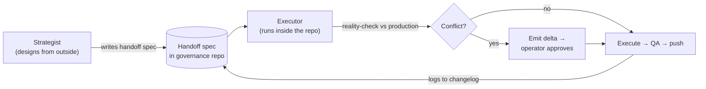

# The Architecture

> The reference half of the playbook. The [main README](../README.md) tells the story (the six lessons); this file is the working manual — the four foundations, the layered protocols that bolt onto them, and the end-to-end lifecycle of one phase.

**Part of:** [AI Dev Governance](../README.md) · **Read this when:** you've absorbed the six lessons and want the operating spec.

---

## The four foundations

Everything else layers on top of these four.

| System | What it answers |
| :---- | :---- |
| **Repo schema + routing** | Which family does this work belong to? Which rules apply? |
| **Context-file cascade** | When rules conflict, which one wins? |
| **Two-role framework** | Who designs the work vs. who executes it? |
| **File-handling protocol** | How does work survive session timeouts and role handoffs? |

---

### Foundation 1 — Repo schema & routing

All work lives under one root, organized into **project families** plus **shared resources**. The three families below intentionally have *different shapes* — that difference matters in the roadmap system.

```
/projects/
├── family-a/                ← centralized "rollup" family
│   (governance: family-a/command/AGENT.md)
│   one command/strategy repo + supporting services
│   (crm, content-engine, public-site, storefront)
│
├── family-b/                ← distributed "per-project" family
│   (governance: family-b/AGENT.md → <project>/AGENT.md)
│   many independent peer repos — one per client/product — no master
│
├── family-c/                ← umbrella "constellation" family
│   (governance: family-c/AGENT.md → family-c/<site>/AGENT.md)
│   a flagship repo + satellites under a shared umbrella
│
├── orchestrator/            ← shared: scheduler, health checks, deploy,
│                              metrics aggregation for ALL families
│
└── architecture-registry/   ← shared: knowledge graphs, onboarding docs,
                               reliability baseline for every repo
```

**Routing rule:** before touching any project, identify its family and read that family's context file first. If the work touches a shared resource (the orchestrator or the registry), read that resource's governance docs too.

---

### Foundation 2 — The context-file cascade

> Throughout, these per-directory instruction files are called `AGENT.md`. In practice this is whatever file your coding agent loads at startup — `CLAUDE.md`, `AGENTS.md`, `.cursorrules`, and so on. The pattern matters more than the filename.

Multiple `AGENT.md` files can apply to one task. Precedence runs top to bottom:

1. **Global** — routing rules, the repo schema, universal policies (commit-and-push discipline, env-var safety, etc.).
2. **Shared resource** — orchestrator / registry governance, when the work touches shared infrastructure.
3. **Family** — family-wide standards: tech stack, conventions, integration patterns.
4. **Project** — `<repo>/AGENT.md`, the most specific file, which overrides the rest for that project.

**Lower levels override higher levels** for project-specific detail; **higher levels** govern routing, shared resources, and cross-family behavior.

Each project's `AGENT.md` carries its own **changelog** at the top — a narrative ledger of every shipped phase and every deviation. This changelog is the load-bearing project memory. A family's `AGENT.md` gets edited only when a pattern proven in one project is **promoted** to a family-wide standard, with a pointer to the reference implementation.

→ Deep dive: [The Context Cascade](context-cascade.md).

---

### Foundation 3 — The two-role framework

| Role | Designs from | Can it commit? | Strengths |
| :---- | :---- | :---- | :---- |
| **Strategist** | *Outside* the codebase | No | Research, architecture, spec authoring |
| **Executor** | *Inside* the repo | Yes (only role that can) | Planning, code, tests, deploy, git |

The handoff between them is the whole game:



A third human-shaped role threads through the diagram without appearing in it: the **Operator** — the person who owns the repo, approves deltas, and runs the manual steps in any Operator Action Block. The Strategist and Executor are AIs; the Operator is the human accountability layer that neither AI is allowed to bypass. See [The Two Roles](two-roles.md#the-operator-the-implicit-third-role) for the full definition.

#### Tier routing

Every task gets a **tier** that decides who handles it and how much protocol applies:

| Tier | Owner | Scope |
| :---- | :---- | :---- |
| **0 — Hotfix** | Executor | Broken build, critical bug — fix first, backfill protocol after |
| **1 — Quick fix** | Executor | Config change, copy edit, small bug — minimal protocol |
| **2 — Standard** | Executor | New feature, API route, schema change — full QA |
| **3 — Strategic** | Strategist → Executor | Architecture, cross-project, protocol changes — Strategist designs, Executor executes |

Default for most work is **Tier 2**.

**Tier negotiation.** Tier assignment is *provisional* until the Sanity Check passes. A task that looks Tier 2 but uncovers architectural ambiguity mid-design is escalated back to the Strategist as Tier 3; a Tier 3 task whose Sanity Check shows the design already fits cleanly may drop to Tier 2 with the Strategist's blessing. The Executor never silently promotes or demotes — escalations are explicit and logged in the checkpoint.

**Tier 0 backfill protocol.** Hotfixes ship without a pre-written handoff, but they don't ship without a paper trail. After a Tier 0 fix lands and the bleed has stopped, the Executor writes a **retroactive checkpoint** at `<repo>/docs/checkpoints/<DATE>-hotfix-<slug>.md` containing: the trigger (what was broken, how it was detected), the diff that shipped, why this couldn't wait for a Tier 2 handoff, and one line for the Strategist on whether anything here should become a family-wide rule. The hotfix isn't "done" until the backfill exists — and the next Strategist session reads it as if it were a delta.

#### What the Strategist must never do

1. Write or edit source files directly.
2. Edit env/config files.
3. Run database commands (push, migrate, seed).
4. Commit or push.

#### What the Strategist *should* do

Research; architect (diagrams, data models, tradeoffs); read the repo (read-only) to ground a spec in real file paths and signatures; write **handoff specs** (file paths, function signatures, env-var names, step-by-step plan, acceptance criteria, and an **Operator Action Block** of manual steps); write checkpoints; answer questions and review screenshots.

> **Read-only inspection is allowed and encouraged.** The Strategist may clone a repo *for reading*, grep it, open files, and quote line numbers in the handoff. What it may not do is edit, run, or commit. A spec grounded in real file paths is dramatically cheaper to execute than one written purely from memory of the schema. See [The Two Roles](two-roles.md#the-strategists-read-only-inspection-window) for the limits.

---

### Foundation 4 — The file-handling protocol

The core operating protocol — it exists because sessions time out, the agent's working filesystem is ephemeral, and two roles share work asynchronously.

**Rule 1 — Plant files on the persistent filesystem.** Write directly to the operator's filesystem, never to the agent's ephemeral container. Verify each write by reading it back. No "I'll save it all at the end."

**Rule 2 — Checkpoint every session, no exceptions.** Location: `<repo>/docs/checkpoints/<DATE>-<slug>.md`. Write one at the start of a multi-step task (plan with all steps unchecked), after each major step, when a timeout feels close, and at session end.

```
# Checkpoint: <Task Name>
**Date:** YYYY-MM-DD
**Status:** IN PROGRESS | BLOCKED | COMPLETE

## Plan
1. [done] Step one — notes
2. [in progress] Step two — got through X
3. [ ] Step three

## Context for next session
- What was the active task when this ended?
- Which file was mid-edit?
- What decisions aren't obvious from the code?
- What should the next session do FIRST?

## Files modified this session
- path/to/file — what changed and why
```

**Rule 3 — Session-start protocol.** A session picking up existing work reads the latest checkpoint, then the full `AGENT.md` cascade, then the execution roadmap; skips completed work; and writes a fresh checkpoint noting where it resumed.

**Rule 4 — Decompose large tasks.** Atomic steps, each producing files on disk, each independently valuable. Prefer many small files over one giant file.

**Rule 5 — Audit your tool surface.** Before relying on a write tool, prove out *where it writes* with a throwaway probe file. The path argument doesn't constrain the destination — the tool does. A generic-sounding name (`create_file`, `save`, an "artifact" tool) can land your file in the agent's container even when the path looks correct. See the [File Handling deep dive](file-handling.md#rule-3--audit-your-tool-surface-before-you-trust-it) for the test and a list of common surprises.

**Rule 6 — Recover from crashes against the disk, not the plan.** When a session times out, the next session reads the checkpoint and *verifies every "done" step against the filesystem* before resuming. The plan is intent; the files are fact. They diverge whenever a timeout lands between an intent and a write. See [File Handling — Rule 5](file-handling.md#rule-5--error-recovery).

**Rule 7 — Anti-patterns.**

| Anti-pattern | Why it's bad | Do instead |
| :---- | :---- | :---- |
| Write to the agent's container | Files vanish on timeout | Write to the persistent filesystem |
| Save all files at the end | Timeout = total loss | Write each file as completed |
| Skip verification | A "success" response can lie | Always read the file back |
| Trust an un-audited write tool | Tool name doesn't tell you where it writes | Run a probe-file test once per new tool |
| Resume a crashed session from the plan | The plan is intent; the files are fact | Verify each "done" step against the disk first |
| Skip checkpoints on "small" tasks | Small tasks grow | Always checkpoint |
| Strategist writes code directly | No type-check, no conventions | Write a handoff spec for the Executor |
| Strategist edits env files | Wrong var names, missed trims | List the vars in a handoff spec |

→ Deep dives: [File Handling](file-handling.md) (the mechanics: which tool, which filesystem, verify, recover) · [Checkpoints & Handoffs](checkpoints-handoffs.md) (the artifacts that carry state across time and roles).

---

## Layered protocols

The four foundations are necessary but not sufficient. Four more protocols bolt on top to handle the cross-cutting concerns that span foundations.

### Layered protocol — the Sanity Check

Because the Strategist designs blind (even with read-only inspection, the live data is the Executor's to see) and the Executor sees production, **every handoff is a design, not a law.** Before implementing one, the Executor runs a **pre-edit pass**: a data-state check (query existing records), a conflict check (naming, unique constraints, FK relationships), and a reversibility check (flag anything already sent, paid, or deployed).

If it finds a conflict, the Executor emits a **delta** — what the spec says vs. what production shows, the minimal correction with evidence, the risk of following the spec as written, and adjusted acceptance criteria — and the operator approves before execution.

**Bounded deviation:** the Executor may deviate only when *all three* hold — the evidence is file-anchored and reproducible, the deviation is minimal and risk-reducing, and scope doesn't expand materially. Every deviation is logged in the completion summary and accumulates in the project's changelog; recurring ones get promoted to family standards — or, when they recur across families, into the cross-family [Delta Log](delta-log.md).

→ Deep dives: [the Sanity Check, in isolation](sanity-check.md) · [how Bounded Deviation works](bounded-deviation.md) · [the Delta Log](delta-log.md)

---

### Layered protocol — Post-execution QA (Tier 2+)

After any Tier-2-or-up work, the Executor must, in order: run the type-checker to zero errors; audit the diff so only intended files changed; scan for hardcoded secrets and unauthenticated admin routes; clean up stray debug logging and TODOs; verify each acceptance criterion PASS/FAIL; emit a one-line QA report; list any manual steps in an Operator Action Block; push to main and confirm the host build is green (never mark complete with unpushed commits); and, if many files changed, regenerate the architecture graph for the shared registry.

→ Deep dive: [The QA Gate](qa-gate.md).

---

### Layered protocol — Governance Sync

At session start, the Executor pulls the shared governance repo (fast-forward only) to get the latest Strategist state. At the end of any session that changed shared governance files (global/family context files, agent memory), it copies those changes back, commits, and pushes. This keeps Strategist and Executor in sync **through files**: the Strategist reads the governance repo to learn what shipped; the Executor reads it to learn what's been handed off. Per-repo `AGENT.md` files are read in place and not synced — only the un-tracked shared files need explicit syncing.

The hard part isn't the happy path — it's what happens when Strategist and Executor make overlapping edits in concurrent sessions, or a fast-forward isn't possible. The deep-dive covers the conflict-resolution path, the "Strategist wins on governance, Executor wins on execution state" rule, and the audit log that catches sync failures before they corrupt state.

→ Deep dive: [Governance Sync](governance-sync.md).

---

### Layered protocol — The roadmap system

A multi-layer ledger that lets two roles and ~20 repos agree on "what's shipped, queued, deferred" without anyone holding the whole graph in their head.

**Two genres — never merged:**

| Genre | Lives in | Writer | Purpose |
| :---- | :---- | :---- | :---- |
| **Product roadmap** | The governance repo | Strategist | Tier/pricing decisions, version planning, deferred product questions |
| **Execution roadmap** | Each repo's `docs/roadmap.md` | Executor | What's left to build, handoff IDs, completion timestamps |

Conflation is the failure mode: when a handoff bundles product-shape items (decisions, renames) with execution-shape items (file paths, commit boundaries), the Executor splits them — product items to the governance repo, execution items to the repo's roadmap.

**One index, one entry point.** A single hand-maintained index file in the governance repo catalogs every product roadmap, every execution roadmap (with links), the complementary registries, and a staleness table. It's the first thing to read before sprint planning or cross-family moves — and the place drift gets caught on audit.

**Three dialects, by work-shape.** Each family evolved its own execution-tracking convention because each family is shaped differently. These are *not* normalized — forcing one convention across differently-shaped work is itself an anti-pattern.

- **Dialect A — centralized rollup.** Driven by handoff-ID prefixes (e.g., `H-042`). Three-file split: active / deferred / archive (timestamped), with a small script migrating completed items to the archive. Sub-repos keep no roadmap of their own; everything rolls up to the command repo's master. One service is the deliberate exception.
- **Dialect B — per-project.** Driven by phase IDs (`1A`, `2B`, `3a–3j`). One file per repo, changelog-style. The repo's `AGENT.md` changelog is the authoritative ledger; the roadmap is a pruned restatement. No deferred/archive split; every project owns its own roadmap; no master.
- **Dialect C — umbrella constellation.** Driven by numbered priority sections (Status / Spec / Problem / Fix). Dual-file: an umbrella-level execution roadmap for cross-site work (lives in the umbrella, not in any one repo) plus a per-repo **registry** — a site-status table and family changelog that is explicitly *not* an execution roadmap. No automation; completions accumulate in a session log.

**A third surface — the dashboard.** An internal dashboard app keeps a database-backed roadmap table rendered as a dashboard widget. It is a *third* surface that does **not** auto-sync with the markdown roadmaps — if an item belongs on the dashboard, it's added there explicitly. The dashboard exists because some audiences (a stakeholder, a client view, an at-a-glance status page) need a *rendered* roadmap, not a markdown one. Treating it as the source of truth would break the system; treating it as an opinionated read-only projection that's manually curated keeps it useful.

→ Deep dive: [The Roadmap System](roadmap-system.md).

---

## Lifecycle of one phase (end-to-end)

A typical Tier-2 phase:

1. **Strategist** writes a handoff spec to the governance repo (grounding it in read-only repo inspection where useful).
2. **Executor** starts a session: pulls the governance repo, reads the handoff, reads the `AGENT.md` cascade, reads the latest checkpoint.
3. **Executor** runs the pre-edit Sanity Check against production; emits any deltas; the **Operator** approves.
4. **Executor** writes an initial checkpoint with the plan, all steps unchecked.
5. **Executor** works step by step — writing files to the persistent filesystem, verifying each write, and updating the checkpoint as steps complete.
6. **Executor** runs post-execution QA (type-check, diff audit, security scan, hygiene).
7. **Executor** commits and pushes — the deploy is the review.
8. **Executor** updates the repo's `AGENT.md` changelog with the phase entry, any deltas, and any family-standard candidates. Recurring or cross-family deltas also land in the [Delta Log](delta-log.md).
9. **Executor** writes a final checkpoint with all outstanding Operator Action Block items (env vars to paste, migrations to run, smoke tests to walk).
10. **Executor** runs Governance Sync, then regenerates the architecture graph if many files changed.
11. **Operator** runs the Action Block items manually (secrets, migrations) — by family rule, never via the agent.

The **next session** picks up from the checkpoint and the changelog entry. Nothing is lost.

---

## When you're over-engineering this

The model scales down. If you're hitting the patterns below, you've adopted more of it than your situation warrants:

| You've over-engineered if… | What to do instead |
| :---- | :---- |
| You have one repo and a four-level cascade | Use a single `AGENT.md`. Add levels only when two repos copy-paste a rule. |
| You're writing handoffs to yourself for a session you'll execute in 10 minutes | Write a one-line checkpoint instead. Handoffs are for crossing role boundaries; if there's no boundary, skip them. |
| You're maintaining a roadmap index with one roadmap in it | Drop the index until you have two surfaces to reconcile. |
| You're running the full QA gate on a Tier-0 hotfix | Run type-check + diff audit only; backfill the rest via the Tier-0 protocol. |
| The Delta Log has fewer than ~5 entries and nothing has been promoted | You don't need it yet; deltas can live in `AGENT.md` changelogs until a pattern emerges. |
| You're treating the Strategist/Executor split as different tools when one tool can do both | Keep the *discipline* of the split (a planning pass, then an execution pass) — but you don't need two products to enforce it. |

The transferable core is small: two roles, files as the only memory, reality-check before executing, declared precedence, accept drift and catch it on audit. Everything else earns its place by surviving a real failure first.

---

## Related

- [The Two Roles](two-roles.md) · [The Context Cascade](context-cascade.md) · [File Handling](file-handling.md) · [Checkpoints & Handoffs](checkpoints-handoffs.md) · [The Sanity Check](sanity-check.md) · [Bounded Deviation](bounded-deviation.md) · [Governance Sync](governance-sync.md) · [The Roadmap System](roadmap-system.md) · [The QA Gate](qa-gate.md) · [The Delta Log](delta-log.md)
- Back to the [main playbook](../README.md)
